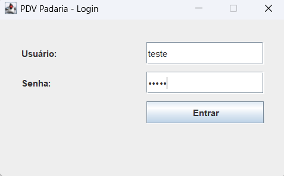
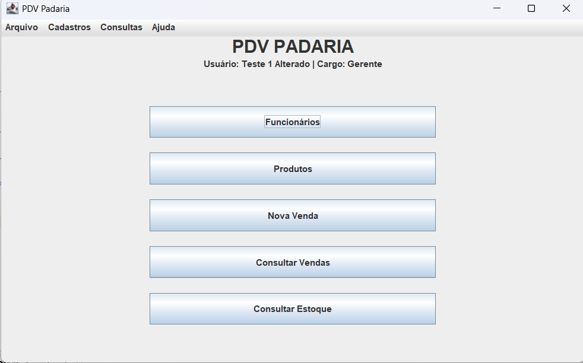
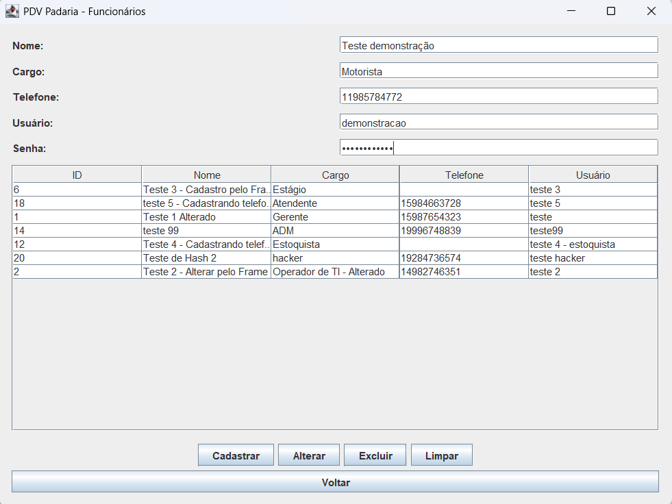
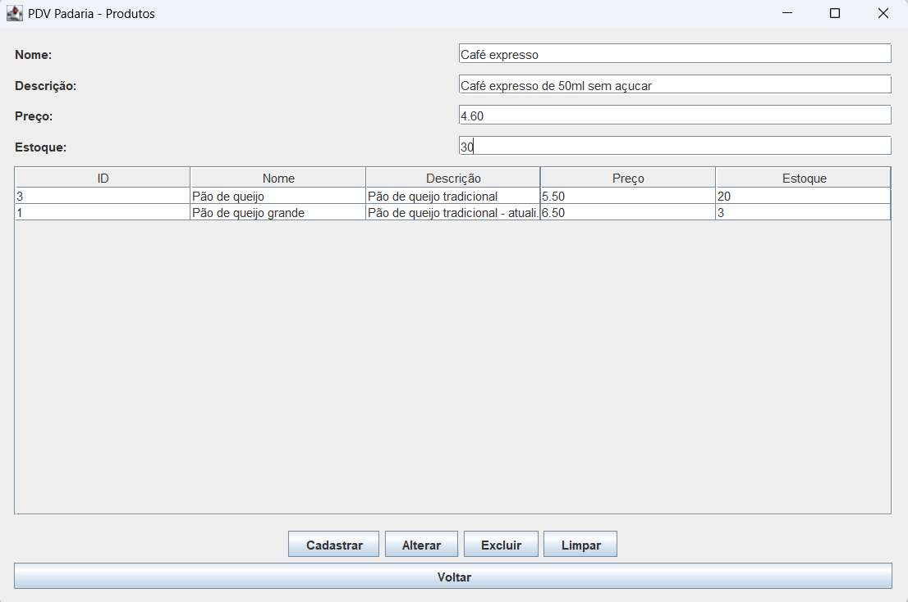
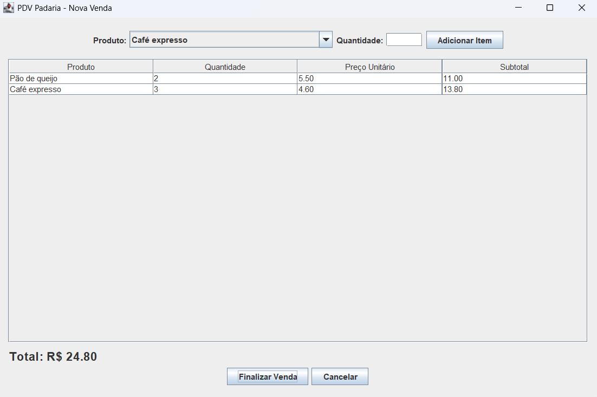
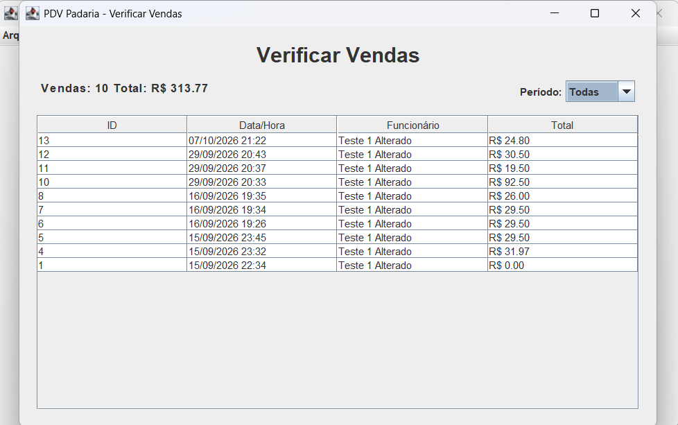
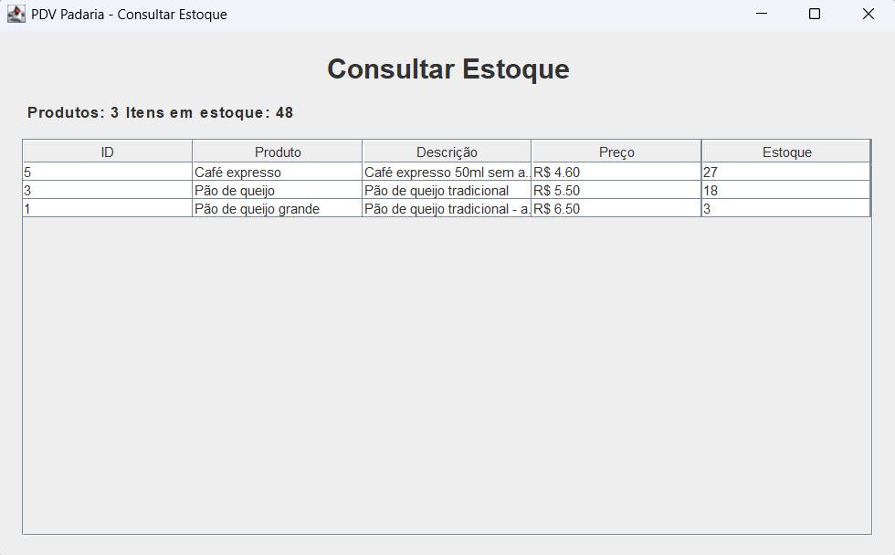

#  Sistema PDV - Padaria

Sistema de Ponto de Venda (PDV) desenvolvido para uma padaria, utilizando Java, Swing e PostgreSQL. O projeto foi desenvolvido com foco no estudo de Programação Orientada a Objetos, persistência de dados e desenvolvimento de aplicações desktop.

##  Demonstração


##  Tecnologias utilizadas

- Java
- Java Swing
- PostgreSQL
- JDBC
- jBCrypt
- NetBeans


##  Funcionalidades

O sistema possui as principais funcionalidades necessárias para o gerenciamento de um pequeno sistema de ponto de venda:

- Sistema de login;
- Cadastro, alteração e exclusão de funcionários;
- Cadastro, alteração e exclusão de produtos;
- Gerenciamento de estoque;
- Registro de vendas;
- Cálculo automático do total das vendas;
- Baixa automática do estoque após uma venda;
- Consulta de vendas;
- Consulta de vendas por período;
- Consulta de estoque;
- Proteção das senhas utilizando BCrypt.


##  Banco de dados

O sistema utiliza PostgreSQL para armazenar e gerenciar os dados da aplicação.

O banco possui as seguintes tabelas principais:

- `funcionario`
- `telefone`
- `produto`
- `venda`
- `item_venda`

O script utilizado para criação do banco de dados está disponível na pasta **Banco de dados**.


##  Organização do projeto

O projeto Java foi organizado utilizando diferentes packages, buscando separar as responsabilidades de cada parte da aplicação:

- **DAO:** responsável pelo acesso e manipulação dos dados no banco de dados;
- **Model:** representa as entidades utilizadas pelo sistema;
- **Service:** concentra regras e operações de negócio;
- **UI:** responsável pelas interfaces gráficas e interação com o usuário.

Essa organização busca facilitar a manutenção, compreensão e evolução do sistema.


##  Segurança

As senhas dos funcionários não são armazenadas em texto puro. O sistema utiliza a biblioteca **jBCrypt** para gerar e verificar hashes das senhas durante o cadastro, alteração e autenticação dos usuários.

As credenciais utilizadas para conexão com o PostgreSQL são configuradas por meio de variáveis de ambiente, evitando que informações sensíveis sejam armazenadas diretamente no código-fonte.


##  Objetivo

Este projeto foi desenvolvido com o objetivo de colocar em prática conceitos de:

- Programação Orientada a Objetos;
- Classes, atributos e métodos;
- Encapsulamento;
- Separação de responsabilidades;
- Interfaces gráficas com Java Swing;
- Persistência de dados;
- Acesso a banco de dados utilizando JDBC;
- Operações CRUD;
- Controle de transações;
- Segurança de senhas.

Além disso, o projeto busca simular um cenário de uso real de um sistema de ponto de venda para uma padaria, servindo como projeto acadêmico e de estudo.

## Demonstração

### Tela de Login



### Tela Principal



### Cadastro de Funcionários



### Cadastro de Produtos



### Registro de Venda



### Consulta de Vendas



### Consulta de Estoque



##  Como executar

### Requisitos

- Java JDK;
- NetBeans ou IDE compatível com Java;
- PostgreSQL;
- Driver JDBC do PostgreSQL;
- Biblioteca jBCrypt.


### Banco de dados

1. Instale o PostgreSQL;
2. Execute o script disponível na pasta **Banco de dados**;
3. Configure as variáveis de ambiente utilizadas pela aplicação:
   - `PDV_DB_USUARIO`
   - `PDV_DB_SENHA`
4. Verifique se o PostgreSQL está em execução.


### Execução

1. Clone o repositório:

```bash
git clone https://github.com/Math-rujo/Projeto-Sistema-PDV-Padaria.git
